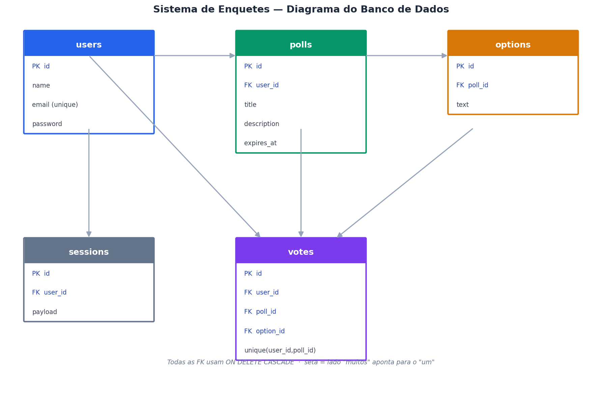
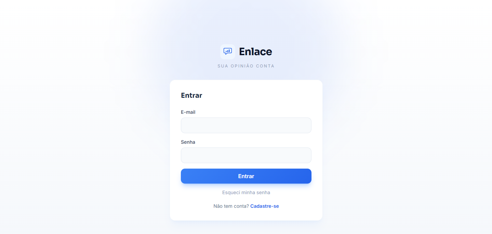
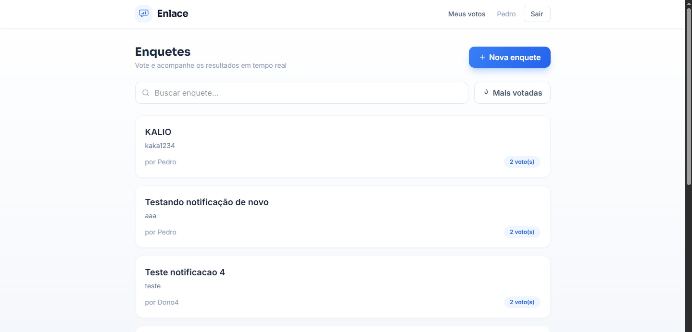
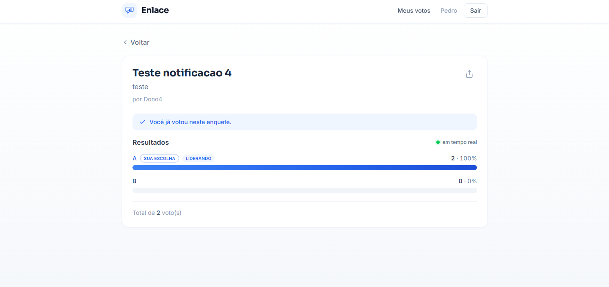

# Sistema de Enquetes (Poll System)

Aplicação web completa de enquetes (polls) com front-end e back-end separados.
Usuários podem se cadastrar, criar enquetes com múltiplas opções, votar e
acompanhar os resultados **atualizando em tempo real**, sem recarregar a página.

Desenvolvido como desafio técnico, com foco em organização de código, separação
de responsabilidades e boas práticas.

---

## Tecnologias

**Back-end**
- Laravel 12 (PHP 8.2+)
- MySQL
- Autenticação via Sessions
- API REST
- Server-Sent Events (SSE) para tempo real

**Front-end**
- React 19 + Vite
- React Router
- Axios
- Tailwind CSS

---

## Funcionalidades

### Obrigatórias
- Cadastro, login e logout de usuários
- Proteção de rotas (só autenticados criam enquetes e votam)
- Criar enquete (título, descrição opcional, 2 a 8 opções, expiração opcional)
- Listar, visualizar, editar e excluir enquetes (editar/excluir só pelo criador)
- Votação com **um voto por usuário por enquete**
- Resultados em **tempo real** via SSE (atualizam sozinhos em todas as telas)

### Diferenciais implementados
- Barras de resultado animadas em tempo real, com destaque para a opção líder
- Busca de enquetes e ordenação por mais votadas
- Rate limiting nos votos
- Validação forte de e-mail (formato + DNS)
- Compartilhamento de enquete por link
- Histórico de votos do usuário
- Recuperação de senha por e-mail (token com expiração, fluxo nativo do Laravel)
- Notificações por e-mail (confirmação de voto ao votante + aviso ao dono da enquete), enviadas via fila
- Enquetes anônimas: voto sem login, com um voto por dispositivo (token no navegador)
- Estado "já votei": quem já votou vê os resultados direto, com a própria escolha destacada

---

## Estrutura do projeto

```
poll-system/
├── backend/         API em Laravel 12  (backend/.env.example)
├── frontend/        Interface em React + Vite  (frontend/.env.example)
├── docs/            Diagrama do banco, collection do Postman e screenshots
├── .gitignore
└── README.md
```

---

## Pré-requisitos

- PHP 8.2 ou superior
- Composer
- Node.js 18+
- MySQL 8+

---

## Como instalar e executar

### 1. Clonar o repositório
```bash
git clone https://github.com/Pedro02088/poll-system.git
cd poll-system
```

### 2. Back-end
```bash
cd backend
composer install
cp .env.example .env          # ajuste as credenciais do banco
php artisan key:generate
php artisan migrate
php artisan serve
```
O back-end sobe em `http://127.0.0.1:8000`.

Crie o banco antes de migrar:
```sql
CREATE DATABASE enquetes;
```

Para as notificações por e-mail (voto confirmado, aviso ao dono e recuperação de
senha) funcionarem, configure um provedor SMTP de teste — recomendamos o
[Mailtrap](https://mailtrap.io) (sandbox gratuito). Preencha as variáveis
`MAIL_*` no `backend/.env` com as credenciais da sua caixa sandbox.

As notificações de voto são **enfileiradas** (não bloqueiam a resposta do
voto). Rode o worker em um terceiro terminal, junto com os dois servidores:
```bash
cd backend
php artisan queue:work
```
Sem o worker rodando, os votos continuam funcionando normalmente — só os
e-mails ficam pendentes na tabela `jobs` até o worker processá-los.

### 3. Front-end
```bash
cd frontend
npm install
cp .env.example .env          # ajuste a URL da API se necessário
npm run dev
```
O front-end sobe em `http://localhost:5173`.

> Rode os dois servidores ao mesmo tempo, em terminais separados.

---

## Variáveis de ambiente

**backend/.env** (principais)
```
DB_DATABASE=enquetes
DB_USERNAME=root
DB_PASSWORD=sua_senha
SESSION_DRIVER=database
SESSION_DOMAIN=localhost
SANCTUM_STATEFUL_DOMAINS=localhost:5173
FRONTEND_URL=http://localhost:5173

QUEUE_CONNECTION=database

MAIL_MAILER=smtp
MAIL_HOST=sandbox.smtp.mailtrap.io
MAIL_PORT=2525
MAIL_USERNAME=seu_usuario_mailtrap
MAIL_PASSWORD=sua_senha_mailtrap
MAIL_FROM_ADDRESS="nao-responda@enlace.com"
MAIL_FROM_NAME="Enlace"
```

**frontend/.env**
```
VITE_API_URL=http://localhost:8000/api
```

---

## API (principais rotas)

| Método | Rota | Descrição | Auth |
|--------|------|-----------|------|
| POST | `/api/register` | Cadastro | Não |
| POST | `/api/login` | Login | Não |
| POST | `/api/logout` | Logout | Sim |
| POST | `/api/forgot-password` | Envia link de recuperação por e-mail | Não |
| POST | `/api/reset-password` | Redefine a senha (com token do e-mail) | Não |
| GET | `/api/me` | Usuário logado | Sim |
| GET | `/api/polls` | Lista enquetes | Não |
| POST | `/api/polls` | Cria enquete | Sim |
| GET | `/api/polls/{id}` | Detalhe da enquete | Não |
| PUT | `/api/polls/{id}` | Edita (só dono) | Sim |
| DELETE | `/api/polls/{id}` | Exclui (só dono) | Sim |
| POST | `/api/polls/{id}/vote` | Vota | Depende ¹ |
| GET | `/api/polls/{id}/stream` | Resultados em tempo real (SSE) | Não |
| GET | `/api/my-votes` | Histórico de votos | Sim |

> ¹ **O voto tem autenticação condicional.** Em enquete comum é obrigatório estar
> logado — sem sessão a API responde `401`. Em enquete anônima
> (`is_anonymous: true`) o voto é aceito sem login, e o votante é identificado
> pelo `voter_token` enviado no corpo da requisição. Um usuário logado sempre
> vota como ele mesmo, mesmo que envie um `voter_token`.

O `stream` é público porque a tela de detalhe também é: qualquer pessoa com o
link acompanha os resultados, mesmo sem conta.

Uma collection do Postman com todas as rotas está em `/docs/poll-system.postman_collection.json`.

---

## Banco de dados

- **users** — usuários (nome, e-mail único, senha com hash)
- **polls** — enquetes (dono, título, descrição, `is_anonymous`, `expires_at`)
- **options** — opções de resposta (pertencem a uma enquete, 2 a 8)
- **votes** — votos (enquete + opção, mais `user_id` **ou** `voter_token`)
- **sessions** — sessões de autenticação (gerenciada pelo Laravel)
- **password_reset_tokens** — tokens de recuperação de senha (expiram em 60 min)
- **jobs** — fila das notificações por e-mail

Todas as chaves estrangeiras usam `ON DELETE CASCADE`.

### Voto único

A regra de um voto por pessoa é garantida **no banco**, por duas restrições
únicas em `votes`:

| Cenário | Restrição | `user_id` | `voter_token` |
|---------|-----------|-----------|---------------|
| Usuário logado | `unique(user_id, poll_id)` | preenchido | `null` |
| Visitante (enquete anônima) | `unique(voter_token, poll_id)` | `null` | UUID do navegador |

Como o MySQL permite múltiplos `NULL` numa restrição única, os dois cenários
convivem na mesma tabela sem que uma regra invalide a outra.



> O diagrama é gerado a partir de `docs/diagrama-banco.html` (Mermaid) — edite o
> HTML e recapture a imagem para mantê-lo em dia com o schema.

---

## Decisões técnicas

- **Laravel 12 em modo enxuto:** sem starter kits (Breeze/Jetstream), apenas o
  necessário. O front-end React separado consome a API, então telas Blade não
  fazem sentido aqui.
- **Sessions em vez de JWT:** para uma aplicação web com front e back no mesmo
  domínio de desenvolvimento, sessions são mais simples e seguras por padrão
  (cookie HttpOnly, criptografado pelo Laravel), sem gerenciamento manual de token.
- **SSE em vez de WebSocket:** o tempo real aqui é unidirecional
  (servidor -> cliente). SSE é nativo do navegador (EventSource), simples de
  servir com PHP e suficiente para o escopo, evitando a complexidade de um
  servidor WebSocket dedicado.
- **Camadas separadas:** Controllers magros, validação em Form Requests,
  autorização em Policies, regra de voto único garantida também no banco
  (unique composta).
- **Sem Repositories:** o Eloquent já é uma boa camada de acesso a dados;
  adicionar Repository neste escopo seria over-engineering.

---

## Segurança

- Senhas com hash (bcrypt)
- Proteção contra SQL Injection (Eloquent / prepared statements)
- Proteção contra XSS (escape automático do React) e CSRF (Laravel)
- Rate limiting nos votos
- Validação forte de e-mail (formato + verificação de DNS)
- Autorização por Policy (só o criador edita/exclui)

---

## Deploy

> **URLs:** front-end: _(a definir)_ · back-end: _(a definir)_

### Arquitetura

| Camada | Serviço | Observação |
|--------|---------|------------|
| Back-end (API) | Railway | PHP + MySQL gerenciado |
| Worker da fila | Railway (2º serviço, mesmo repo) | `php artisan queue:work` para os e-mails |
| Banco | Railway MySQL | plugin do próprio Railway |
| Front-end | Vercel | build estático do Vite |

Front e back ficam em **domínios diferentes**, então a autenticação por sessão
depende de cookie *cross-site*. Isso exige três coisas:

1. `SESSION_SAME_SITE=none` — sem isso o navegador não envia o cookie para outro domínio.
2. `SESSION_SECURE_COOKIE=true` — o navegador só aceita `SameSite=None` em HTTPS.
3. `trustProxies` habilitado (já configurado em `bootstrap/app.php`) — o Railway
   termina o TLS num proxy; sem confiar nele o Laravel enxerga a requisição como
   `http` e não marca o cookie como `Secure`.

O CORS lê a origem liberada de `FRONTEND_URL` (aceita várias, separadas por
vírgula) e mantém `supports_credentials: true`.

### Sobre o tempo real (SSE) em produção

O endpoint `/api/polls/{id}/stream` **não mantém conexão aberta**: envia um
snapshot dos resultados e encerra, e o navegador reconecta sozinho a cada 1s
(campo `retry` do EventSource). Essa escolha evita segurar um processo do
servidor por conexão — o que seria um problema tanto no `artisan serve` quanto
num pool de workers em produção.

### Back-end no Railway

1. Crie um projeto a partir do repositório, apontando a raiz para `backend/`.
2. Adicione o plugin **MySQL** — ele injeta as variáveis do banco.
3. Configure as variáveis de ambiente (seção abaixo).
4. O `Procfile` define dois processos. O Railway roda **um processo por serviço**,
   então crie **dois serviços a partir do mesmo repo**:
   - **web** — usa a linha `web` do `Procfile` (roda as migrations e sobe a API);
   - **worker** — sobrescreva o start command para `php artisan queue:work --sleep=3 --tries=3 --max-time=3600`.

> Sem o serviço **worker**, a aplicação funciona normalmente — só os e-mails
> (confirmação de voto, aviso ao dono e recuperação de senha) ficam pendentes na
> tabela `jobs` até haver um worker para processá-los.

#### Variáveis de ambiente (Railway)

```
APP_NAME=Enlace
APP_ENV=production
APP_KEY=                      # gere com: php artisan key:generate --show
APP_DEBUG=false
APP_URL=https://SEU-BACKEND.up.railway.app

DB_CONNECTION=mysql
DB_HOST=...                   # fornecidos pelo plugin MySQL
DB_PORT=...
DB_DATABASE=...
DB_USERNAME=...
DB_PASSWORD=...

FRONTEND_URL=https://SEU-FRONT.vercel.app

SESSION_DRIVER=database
SESSION_SAME_SITE=none
SESSION_SECURE_COOKIE=true
SESSION_DOMAIN=               # deixe vazio

QUEUE_CONNECTION=database

MAIL_MAILER=smtp
MAIL_HOST=sandbox.smtp.mailtrap.io
MAIL_PORT=2525
MAIL_USERNAME=...
MAIL_PASSWORD=...
MAIL_FROM_ADDRESS="nao-responda@enlace.com"
MAIL_FROM_NAME="Enlace"
```

### Front-end na Vercel

1. Importe o repositório e defina **Root Directory** como `frontend/`.
2. Framework: Vite (detectado automaticamente; build `npm run build`, saída `dist`).
3. Variável de ambiente:

```
VITE_API_URL=https://SEU-BACKEND.up.railway.app/api
```

> O `VITE_API_URL` é lido de variável de ambiente, com fallback para
> `http://localhost:8000/api` apenas em desenvolvimento. Como o Vite embute a
> variável **no momento do build**, defina-a antes do deploy e refaça o build ao
> alterá-la — se ela faltar na Vercel, o front tentará chamar `localhost` em
> produção.

### Ordem sugerida

1. Suba o back-end no Railway e anote a URL.
2. Faça o deploy do front na Vercel com `VITE_API_URL` apontando para ela.
3. Volte ao Railway e ajuste `FRONTEND_URL` com a URL da Vercel (CORS).
4. Redeploy do back-end para aplicar.

---

## Possíveis melhorias

- Paginação na listagem
- Testes automatizados (PHPUnit / Vitest)
- Deploy (Railway/Render + Vercel)

---

## Screenshots

### Login
Autenticação com a identidade visual do Enlace e recuperação de senha por e-mail.



### Enquetes
Listagem com busca por título e ordenação por mais votadas.



### Resultados em tempo real
Barras animadas via SSE, com destaque da opção líder, marcação do voto do
usuário e indicador de atualização ao vivo.


